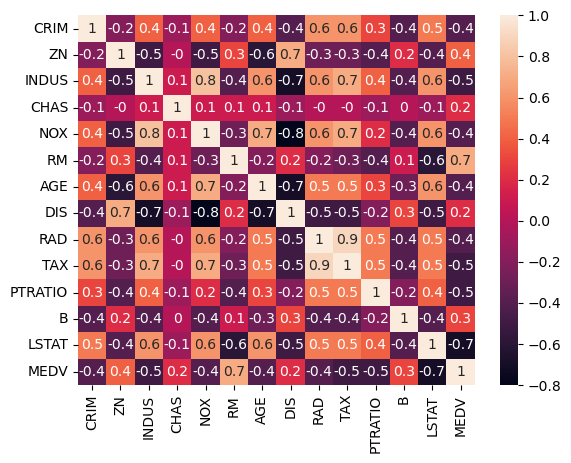
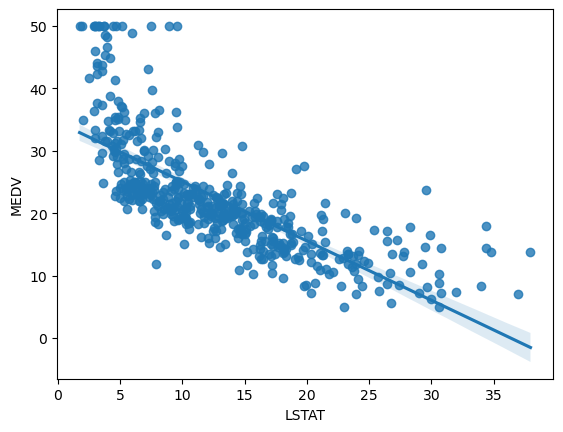

## **Matrice de corrélation**

La matrice de corrélation indique les valeurs de corrélation, qui mesurent le degré de relation linéaire entre chaque paire de variables. Les valeurs de corrélation peuvent être comprises entre -1 et +1. Si les deux variables ont tendance à augmenter et à diminuer en même temps, la valeur de corrélation est positive. Lorsqu'une variable augmente alors que l'autre diminue, la valeur de corrélation est négative.

```py
# Afficher la matrice de corrélation
matriceCorr = data.corr().round(1)
sns.heatmap(data=matriceCorr, annot = True)
```
??? success "Output"
    
- [x] Nous notons qu'il y a plusieurs correlations entre les colonnes, mais nous n'allons pas prendre en considération ces corrélations pour l'instant parce que les réseaux de neuronnes peuvent détecter les corrélations ainsi les traiter. 

## **Représentations des colonnes deux à deux**

```py
# Afficher les représentations des colonnes deux à deux
sns.pairplot(dataset)
```
??? success "Output"
    
```py
# Afficher "MEDV" en fonction de "CRIM"
plt.scatter(dataset['CRIM'],dataset['MEDV'])
plt.xlabel("Crime Rate")
plt.ylabel("Medv")
```
??? success "Output"
    
```py
# Afficher "RM" en fonction de "MEDV"
plt.scatter(dataset['RM'],dataset['MEDV'])
plt.xlabel("RM")
plt.ylabel("Medv")
```
??? success "Output"
    
```py
# Tracer les données et l'ajustement d'un modèle de régression linéaire MEDV=f(RM)
sns.regplot(x="RM",y="MEDV",data=dataset)
```
??? success "Output"
    
```py
# Tracer les données et l'ajustement d'un modèle de régression linéaire MEDV=f(LSTAT)
sns.regplot(x="LSTAT",y="MEDV",data=dataset)
```
??? success "Output"
    
```py
# Tracer les données et l'ajustement d'un modèle de régression linéaire MEDV=f(CHAS)
sns.regplot(x="CHAS",y="MEDV",data=dataset)
```
??? success "Output"
    
```py
# Tracer les données et l'ajustement d'un modèle de régression linéaire MEDV=f(PTRATIO)
sns.regplot(x="PTRATIO",y="MEDV",data=dataset)
```
??? success "Output"
    
